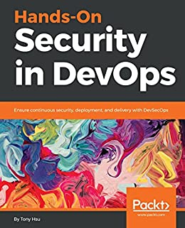
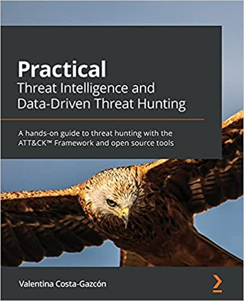
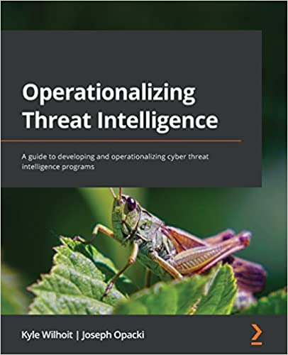
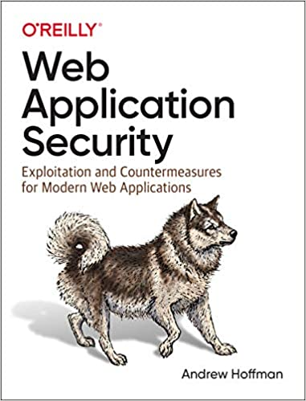
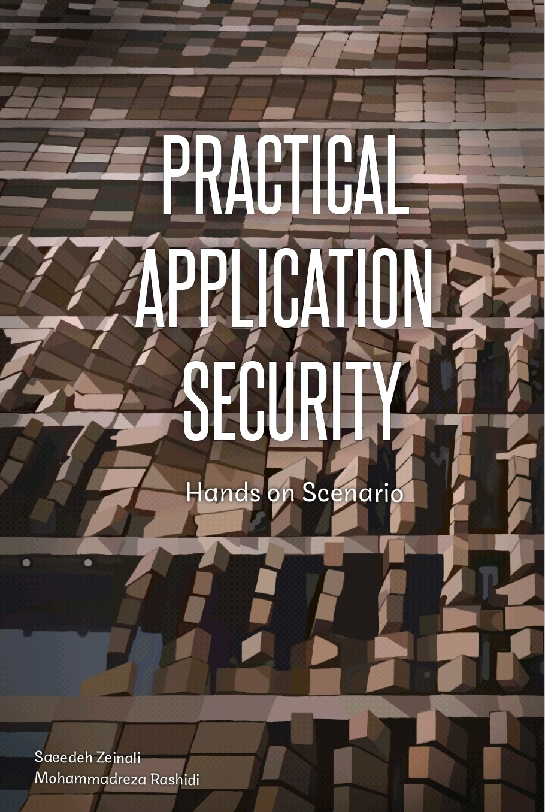

# Resources

{: .no_toc }

## Table of contents
{: .no_toc .text-delta }

1. TOC
{:toc}

---

## Books

### Hands-On Security in DevOps

[Hands-On Security in DevOps](https://www.amazon.com/Hands-Security-DevOps-continuous-deployment/dp/1788995503){: .btn .btn-purple .mr-2 }

### Practical Threat Intelligence and Data-Driven Threat Hunting: A hands-on guide to threat hunting with the ATT&CK™ Framework and open source tools

Get to grips with cyber threat intelligence and data-driven threat hunting while exploring expert tips and techniques

[Practical Threat Intelligence and Data-Driven Threat Hunting](https://www.amazon.com/Practical-Threat-Hunting/dp/1838556370){: .btn .btn-purple .mr-2 }

### Operationalizing Threat Intelligence: A guide to developing and operationalizing cyber threat intelligence programs

Learn cyber threat intelligence fundamentals to implement and operationalize an organizational intelligence program

[Operationalizing Threat Intelligence](https://www.amazon.com/Operationalizing-Threat-Intelligence-operationalizing-intelligence/dp/1801814686){: .btn .btn-purple .mr-2 }

### Web Application Security: Exploitation and Countermeasures for Modern Web Applications

While many resources for network and IT security are available, detailed knowledge regarding modern web application security has been lacking―until now. This practical guide provides both offensive and defensive security concepts that software engineers can easily learn and apply.

[Web Application Security: Exploitation and Countermeasures for Modern Web Applications](https://www.amazon.com/Web-Application-Security-Exploitation-Countermeasures/dp/1492053112){: .btn .btn-purple .mr-2 }

### Practical Application Security

A Book About more +15 Vulnerability Type Attack & Defence and Tutorial About Software Security Tools and Appliance.

[Practical Application Security](https://leanpub.com/practicalappsec){: .btn .btn-purple .mr-2 }

## Guidelines

### OWASP DevSecOps Guidelines

The OWASP DevSecOps Guideline explains how we can implement a secure pipeline and use best practices and introduce tools that we can use in this matter. Also, the project is trying to help us promote the shift-left security culture in our development process. This project helps any companies of each size that have a development pipeline or, in other words, have a DevOps pipeline. We try to draw a perspective of a secure DevOps pipeline during this project and then improve it based on our customized requirements.

[OWASP DevSecOps Guideline](https://owasp.org/www-project-devsecops-guideline/latest/){: .btn .btn-purple .mr-2 }

### 6mile DevSecOps Playbook

This playbook will help you introduce effective DevSecOps practices in your company, regardless of size. We provide explicit guidance and actionable steps to introduce security controls, measure their effectiveness, and demonstrate value for money to your business leaders. Following this playbook will help teams build materially more secure applications, and that in the end, is the intent.

[6mile DevSecOps Playbook](https://github.com/6mile/DevSecOps-Playbook){: .btn .btn-purple .mr-2 }

### Aif4thah Dojo-101

Knowledge base in cybersecurity, administration and secure development

[Aif4thah Dojo-101](https://github.com/Aif4thah/Dojo-101){: .btn .btn-purple .mr-2 }

### sottlmarek DevSecOps

[sottlmarek DevSecOps](https://github.com/sottlmarek/DevSecOps)

### AcalephStorage Awesome DevSecOps

[AcalephStorage Awesome DevSecOps](https://github.com/AcalephStorage/awesome-devops)

### wmariuss Awesome DevOps

[wmariuss Awesome DevOps](
https://github.com/wmariuss/awesome-devops#api-gateway)

## Framework

### Cloud Adoption Framework

Proven guidance and best practices that help you confidently adopt the cloud and achieve business outcomes.

[Microsoft Cloud Adoption Framework](https://learn.microsoft.com/en-us/azure/cloud-adoption-framework/){: .btn .btn-purple .mr-2 }

## Cheatsheet

Hi! I’m Lars Windolf and my expertise is on system architecture and DevSecOps. I strongly care about collecting and sharing knowledge and use this site as a resource for my daily work.

[lzone](https://lzone.de/cheat-sheet/Container){: .btn .btn-purple .mr-2 }

